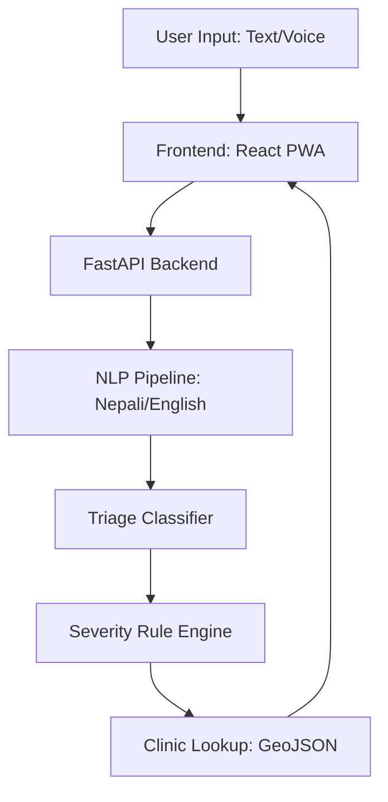

# TriageTech

## Problem Statement
Providing accessible, AI-driven medical triage and clinical guidance in both Nepali and English to bridge the gap in healthcare accessibility in Nepal.

## Architecture Diagram

## Data Sources
- Public health facility coordinates from Nepal MoHP.
- Symptom-condition mapping based on WHO ICD-10 criteria.

## Limitations
- This tool is for guidance only and does not replace professional medical advice.
- Requires internet connectivity for ML model inference (initially).

## Setup Guide
### Backend
1. `cd src/backend`
2. `pip install -r requirements.txt`
3. `python api/main.py`

### Frontend
1. `cd src/frontend`
2. `npm install`
3. `npm start`

## Team Credits
- Team TriageTech
